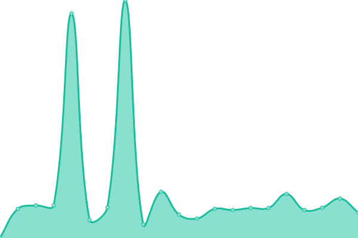

# [📈 Live Status](https://nanangsb.github.io/upptime): <!--live status--> **🟩 All systems operational**

This repository contains the open-source uptime monitor and status page for [nanangsb](https://www.nanang.id), powered by [Upptime](https://github.com/upptime/upptime).

With [Upptime](https://upptime.js.org), you can get your own unlimited and free uptime monitor and status page, powered entirely by a GitHub repository. We use [Issues](https://github.com/nanangsb/upptime/issues) as incident reports, [Actions](https://github.com/nanangsb/upptime/actions) as uptime monitors, and [Pages](https://nanangsb.github.io/upptime) for the status page.

<!--start: status pages-->
<!-- This summary is generated by Upptime (https://github.com/upptime/upptime) -->
<!-- Do not edit this manually, your changes will be overwritten -->
<!-- prettier-ignore -->
| URL | Status | History | Response Time | Uptime |
| --- | ------ | ------- | ------------- | ------ |
|  [Google](https://www.google.com) | 🟩 Up | [google.yml](https://github.com/nanangsb/upptime/commits/HEAD/history/google.yml) | 

 119ms
     
 | 

<a href="https://nanangsb.github.io/upptime/history/google">100.00%</a>
    

|  [Quran Abu Sofiya](https://quran.abusofiya.com) | 🟩 Up | [quran-abu-sofiya.yml](https://github.com/nanangsb/upptime/commits/HEAD/history/quran-abu-sofiya.yml) | 

 148ms
     
 | 

<a href="https://nanangsb.github.io/upptime/history/quran-abu-sofiya">100.00%</a>
    

|  [Zikir V1](https://zikir.org) | 🟩 Up | [zikir-v1.yml](https://github.com/nanangsb/upptime/commits/HEAD/history/zikir-v1.yml) | 

 340ms
     
 | 

<a href="https://nanangsb.github.io/upptime/history/zikir-v1">100.00%</a>
    

|  [Zikir V2](https://v2.zikir.org) | 🟩 Up | [zikir-v2.yml](https://github.com/nanangsb/upptime/commits/HEAD/history/zikir-v2.yml) | 

 258ms
     
 | 

<a href="https://nanangsb.github.io/upptime/history/zikir-v2">100.00%</a>
    

|  [Api Artikel Islami](https://api-artikel.abusofiya.com/api) | 🟩 Up | [api-artikel-islami.yml](https://github.com/nanangsb/upptime/commits/HEAD/history/api-artikel-islami.yml) | 

 142ms
     
 | 

<a href="https://nanangsb.github.io/upptime/history/api-artikel-islami">100.00%</a>
    

|  [Api Artikel Islami V2](https://api-artikel2.abusofiya.com/api/news/source?code=MUSLIM) | 🟩 Up | [api-artikel-islami-v2.yml](https://github.com/nanangsb/upptime/commits/HEAD/history/api-artikel-islami-v2.yml) | 

 15435ms
     
 | 

<a href="https://nanangsb.github.io/upptime/history/api-artikel-islami-v2">96.84%</a>
    

|  [Kajian.co](https://kajian.co) | 🟩 Up | [kajian-co.yml](https://github.com/nanangsb/upptime/commits/HEAD/history/kajian-co.yml) | 

 2192ms
     
 | 

<a href="https://nanangsb.github.io/upptime/history/kajian-co">100.00%</a>
    

|  [Quran Site](https://quransite.com) | 🟩 Up | [quran-site.yml](https://github.com/nanangsb/upptime/commits/HEAD/history/quran-site.yml) | 

 404ms
     
 | 

<a href="https://nanangsb.github.io/upptime/history/quran-site">100.00%</a>
    

|  [Majemuk](https://majemuk.com) | 🟩 Up | [majemuk.yml](https://github.com/nanangsb/upptime/commits/HEAD/history/majemuk.yml) | 

 2283ms
     
 | 

<a href="https://nanangsb.github.io/upptime/history/majemuk">100.00%</a>
    

|  [Infigur](https://infigur.com) | 🟩 Up | [infigur.yml](https://github.com/nanangsb/upptime/commits/HEAD/history/infigur.yml) | 

 7383ms
     
 | 

<a href="https://nanangsb.github.io/upptime/history/infigur">100.00%</a>
    

|  [Tool Unity](https://toolunity.com) | 🟩 Up | [tool-unity.yml](https://github.com/nanangsb/upptime/commits/HEAD/history/tool-unity.yml) | 

 2179ms
     
 | 

<a href="https://nanangsb.github.io/upptime/history/tool-unity">100.00%</a>
    

<!--end: status pages-->

[**Visit our status website →**](https://nanangsb.github.io/upptime)

## 📄 License

- Powered by: [Upptime](https://github.com/upptime/upptime)
- Code: [MIT](./LICENSE) © [Anand Chowdhary](https://anandchowdhary.com), supported by [Pabio](https://pabio.com)
- Data in the `./history` directory: [Open Database License](https://opendatacommons.org/licenses/odbl/1-0/)
